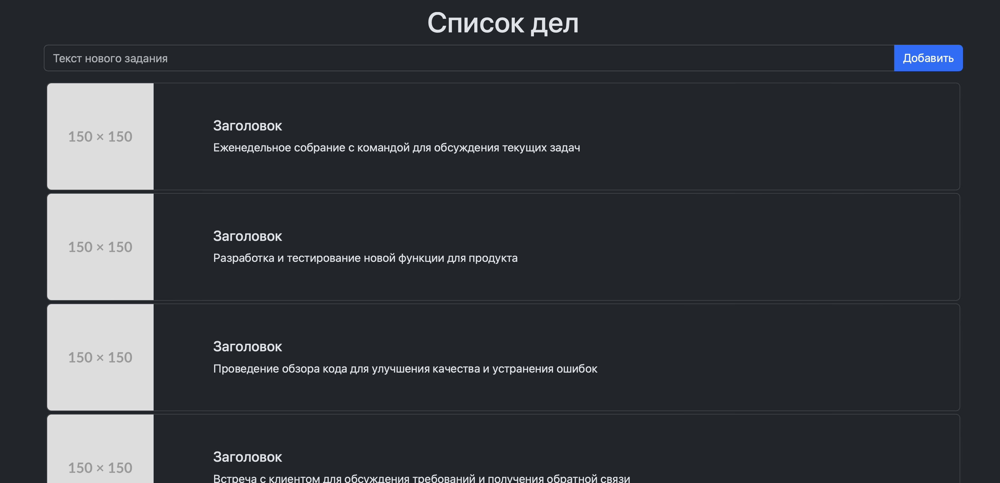

## Буткемп "Записки юного программиста"

### Откройте для себя мир fullstack-разработки с интенсивным курсом!

Научитесь создавать современные и функциональные веб-приложения, используя передовые технологии и инструменты. Курс охватывает все, от основ HTML и CSS до продвинутых концепций JavaScript, React и minimal Web API на языке C#. 

Погрузитесь в практическое обучение, которое включает реальные проекты и задачи, получите навыки, востребованные на рынке труда. Начните свой путь к успешной карьере в IT прямо сейчас!

### [ПРИСОЕДИНИТЬСЯ](https://stepik.org/a/197191/pay?promo=0e3fe54a49128574&utm_source=github&utm_medium=code&utm_campaign=july)

### Как развернуть проект

1. **Скачать и установить Node.js:**
   - Перейдите по [ссылке на официальный сайт Node.js](https://nodejs.org/en) и установите последнюю версию.

2. **Скачать и установить Visual Studio Code (VS Code):**
   - Перейдите по [ссылке на официальный сайт VS Code](https://code.visualstudio.com) и установите редактор.

3. **Изучить документацию по React:**
   - Рекомендуется ознакомиться с [документацией React](https://react.dev) для лучшего понимания используемых технологий.

4. **Установить расширение Live Server для VS Code:**
   - Перейдите по [ссылке на страницу расширения](https://marketplace.visualstudio.com/items?itemName=ms-vscode.live-server) и установите его. Расширение позволяет запускать локальный сервер для предпросмотра проекта.

5. **Изучить документацию по Bootstrap:**
   - Перейдите по [ссылке на документацию Bootstrap](https://getbootstrap.com/docs/5.3/getting-started/introduction/) для понимания стилей, используемых в проекте.

6. **Развернуть проект:**
   - Откройте терминал в папке `react-todo-list`.
   - Выполните команду `npm install` (или `npm i`) для установки всех зависимостей.
   - После установки зависимостей выполните команду `npm start` для запуска проекта.

7. **Открыть проект в браузере:**
   - Откройте браузер и перейдите по адресу [http://localhost:3000](http://localhost:3000). Вы должны увидеть страницу со списком дел.

### ТЗ на самостоятельную работу

**Цель:** Добавить возможность ввода заголовка задачи и ссылки на изображение, помимо текста задачи.

**Шаги выполнения:**

1. **Добавление полей ввода для заголовка и ссылки на изображение:**
   - В компоненте `App` добавьте два новых поля ввода: одно для заголовка задачи, другое для ссылки на изображение.
   
2. **Обновление состояния:**
   - Добавьте два новых состояния для хранения значения заголовка задачи и ссылки на изображение.

3. **Изменение функции добавления задачи:**
   - Обновите функцию `addTaskBtn`, чтобы она учитывала новые значения (заголовок и ссылку на изображение) при добавлении новой задачи.

4. **Обновление разметки компонента `App`:**
   - Визуально разделите поля ввода для заголовка, текста и ссылки на изображение.

**Примерный вид после выполнения**

